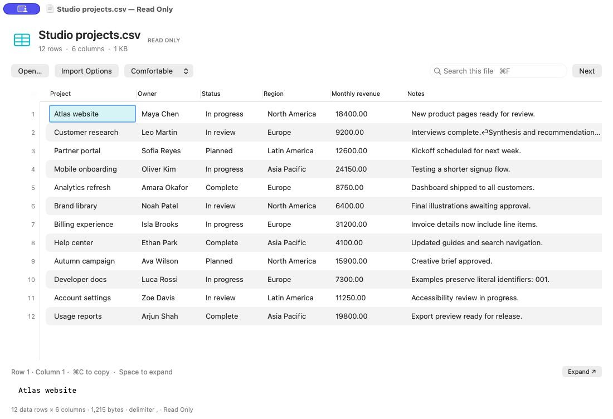

# Rowlight

**See your data clearly.** A lightweight, native Mac app for inspecting CSV and TSV files. Formerly Tableview.



Preview **0.2.1** (build 4). A native, read-only CSV viewer for Apple Silicon Macs (macOS 13+). Milestone 1 implements CSV; XLSX, editing, and AI are not implemented.

The welcome screen offers **Open File…**, drag-and-drop guidance, and the **⌘O** shortcut. The file heading shows dimensions and size. Columns start at widths sampled from up to 24 records; choose Comfortable or Compact row density. **Import Options** contains header, delimiter, and monospaced-text controls. The value inspector starts compact; use **Expand** or Space from the grid to toggle its larger view. Find supports standard text cut/copy/paste shortcuts. See the [latest desktop check](docs/evidence/desktop-check-2026-09-21.md) for verified interactions and remaining QA scope.

## Download

[**Download Rowlight v0.2.1 for Apple Silicon**](https://github.com/kevindrafts/rowlight/releases/download/v0.2.1/Rowlight-0.2.1-arm64.dmg) · [Release notes and SHA-256 checksum](https://github.com/kevindrafts/rowlight/releases/tag/v0.2.1)

Requires an Apple Silicon (M-series) Mac running macOS 13 or newer. Open the DMG and drag Rowlight into Applications. This preview is Developer ID-signed by Lucas Olson, notarized by Apple, and stapled. Older Tableview release assets are legacy development previews.

## Build from source

The signed download above is packaged by Relic; local builds use ad-hoc signing. See the [release handoff](docs/release-handoff-v0.2.1.md) for the distribution workflow.

Use Swift 6 or newer with the macOS SDK (Xcode or current Command Line Tools):

```sh
scripts/swift-local.sh run TableCoreChecks
scripts/swift-local.sh run Rowlight --ui-self-check
scripts/swift-local.sh build -c release
scripts/build-app.sh
open dist/Rowlight.app
# Open a specific file without changing its default association:
open -a "$PWD/dist/Rowlight.app" /path/to/example.csv
```

`scripts/swift-local.sh` supplies all repository-local cache/TMPDIR flags and `--disable-sandbox` needed in this environment. No third-party packages are required. A full Xcode installation is optional when compatible Command Line Tools are already installed. The build produces an ad-hoc signed local `dist/Rowlight.app`, with CSV/TSV Viewer registration at Alternate rank. It does not install the app or change default associations. It is not notarized for distribution.

Use **Open… / ⌘O**, drop local files onto a window, or use Finder’s **Open With** to open files in separate windows. Drag column dividers to resize; scroll vertically and horizontally. A fixed left gutter numbers displayed data rows from 1 and stays visible while scrolling horizontally. Header mode restarts numbering at the first data record; the gutter is never a data column. Click a cell and use arrow keys or Tab/Shift-Tab to move. Only the selected cell is highlighted, with a native focus indicator; its row/column appears above the inspector. Click empty grid space to clear selection. Restrained teal accents and semantic system colors support light and dark appearances. **⌘C** from the grid copies the selected cell’s complete literal value. The selectable inspector shows the full value, including newlines. Copy covers one cell; rectangular/multiple-cell selection is outside this milestone.

**⌘F** focuses Find. Return, **Next**, or **⌘G** performs a case-insensitive literal substring search and wraps. The header is excluded when **First record is header** is enabled. Cancel stops loading/search; changing options or closing a window invalidates pending results. Changing the delimiter reloads the file. Header mode defaults on and can be disabled for headerless files.

Comma, semicolon, tab, and pipe are supported. Auto detection counts separators outside quotes in the first logical record, inspecting at most 64 KiB; ties prefer comma. Use the delimiter control for ambiguous files. The parser handles quoted separators, escaped quotes, multiline fields, UTF-8/BOM, CRLF/LF/CR, blank records, empty fields, and irregular row widths. It preserves leading zeros, long identifiers, whitespace, date-looking strings, and formula-looking text without evaluation or conversion. Grid previews truncate long text and mark line breaks; inspector and copy preserve the complete value. Missing fields appear blank. Malformed CSV, invalid UTF-8, UTF-16, NUL/binary content, and resource limits produce errors.

TableCore retains an immutable byte snapshot and indexes record offsets. Rows decode on demand; the UI cache holds at most 128 rows and 8 MiB of accounted storage. Loading/indexing and search run off the main thread with cooperative cancellation and stale-result protection. **The first preview waits for full indexing**; this is not a streaming preview. Limits per file: 256 MiB input, 2,000,000 records, 4,096 columns, and 8 MiB per encoded record. Multiple windows each own their snapshot/cache. Cache accounting includes estimated overhead, not an exact process-memory guarantee. Files changed externally are not auto-reloaded.

The standalone `TableCoreChecks` executable uses throwing assertions and exits nonzero on failure. All eight original parser cases were migrated; XCTest was an implementation choice and is no longer required. See [testing evidence](docs/testing.md), [status](STATUS.md), and raw [10 MB](docs/evidence/bench-10MB.json) / [100 MB](docs/evidence/bench-100MB.json) benchmark results. AppKit and bundle checks pass; the desktop QA note records the interactions and light-appearance views verified so far. See the [open-source readiness audit](docs/open-source-audit.md) before publication.

## Contributing and security

Bug reports and focused contributions are welcome. Read [CONTRIBUTING.md](CONTRIBUTING.md) for development guidance and [SECURITY.md](SECURITY.md) for private vulnerability reporting. Use synthetic data in issues and screenshots.

## License

Rowlight is available under the [MIT license](LICENSE).
